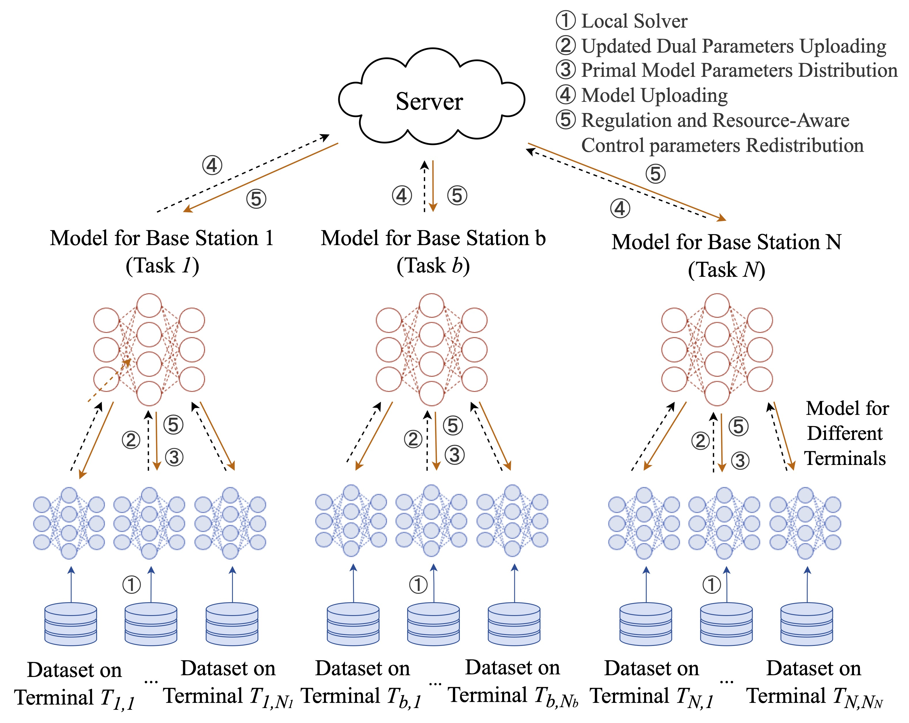
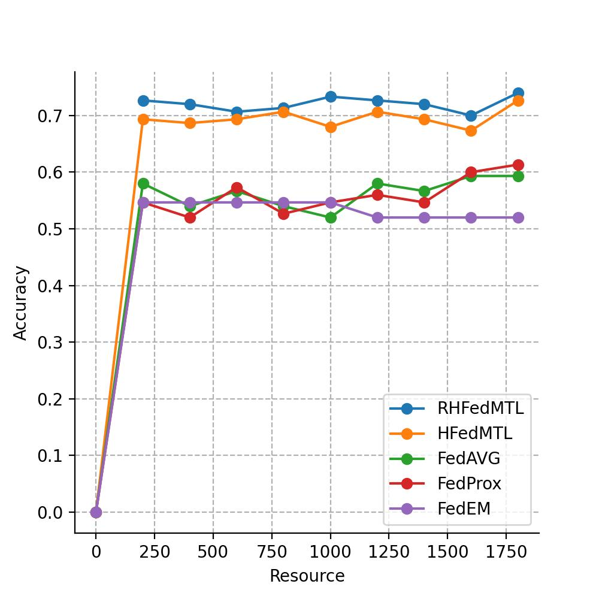

# RHFedMTL
> Resource-Aware Hierarchical Federated Multi-Task Learning

## Abstract

The wide applications of artificial intelligence (AI) on massive Internet-of-things or smartphones raises significant concerns about privacy, heterogeneity, and resource efficiency. Correspondingly, federated learning emerges as an effective way to enable AI over massively distributed nodes without uploading the raw data. Conventional works mostly focus on learning a single unified model for one solitary task. Multi-task learning (MTL) outperforms single-task learning by training multiple models concurrently, leading to reduced model sizes and increased flexibility. However, existing federated learning efforts often face challenges in efficiently managing MTL scenarios, particularly with the presence of stragglers, without incurring prohibitive computation and communication costs. In this paper, inspired by the natural cloud-BS-terminal hierarchy of cellular networks, we provide a viable resource-aware hierarchical federated MTL (RHFedMTL) solution to meet the task heterogeneity corresponding to different non-IID (independent and identically distributed) training datasets. Specifically, a primal-dual method has been leveraged to effectively transform the coupled MTL into some local optimization sub-problems within BSs. Therefore, it enables solving different tasks within a BS and aggregating the multi-task result in the cloud without uploading the raw data. Furthermore, compared with existing methods that reduce resource costs by simply changing the aggregation frequency, we dive into the intricate relationship between resource consumption and learning accuracy, and develop a resource-aware learning strategy for adjusting the iteration number on local terminals and BSs to meet the resource budget. Extensive simulation results demonstrate the effectiveness and superiority of RHFedMTL in terms of improving the learning accuracy and boosting the convergence rate.

<p align="center">

</p>

## Quick Start

```bash
git clone https://github.com/rhfedmtl/RHFedMTL.git
cd RHFedMTL
python -m venv venv
source venv/bin/activate
pip install -r requirements.txt 

python main.py
```

<p align="center">

</p>